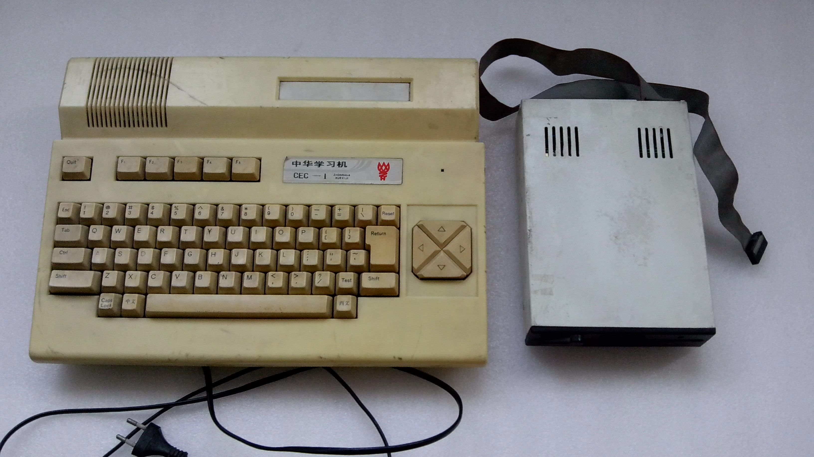

# CEC-X FPGA

Welcome to CEC-X_FPGA project. This project is an attempt to recreate the once famous CEC-I/CEC-E computer in 80's on Altera Cyclone based FPGA boards.

Features implemented:
1. VGA output
2. internal ROM ROM on flash
3. Buzzer output
4. PS/2 keyboard support (Ctrl+F12 to reset).
5. 10MHz overclock on SW0 SW1

***Planned***

1. 

***Screenshots***  

***Supported boards***

- Terasic DE1
- Terasic DE2

***Folder structures***

